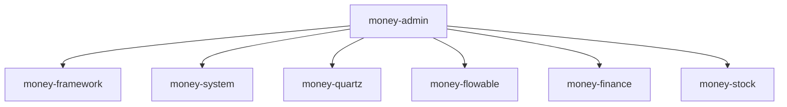
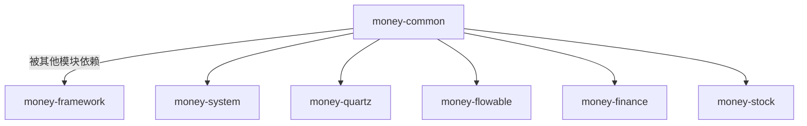
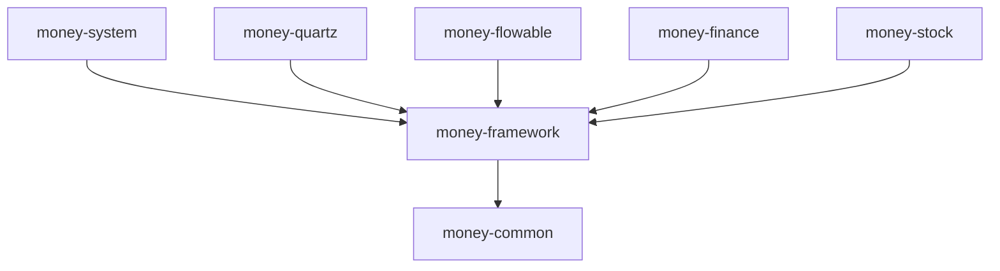
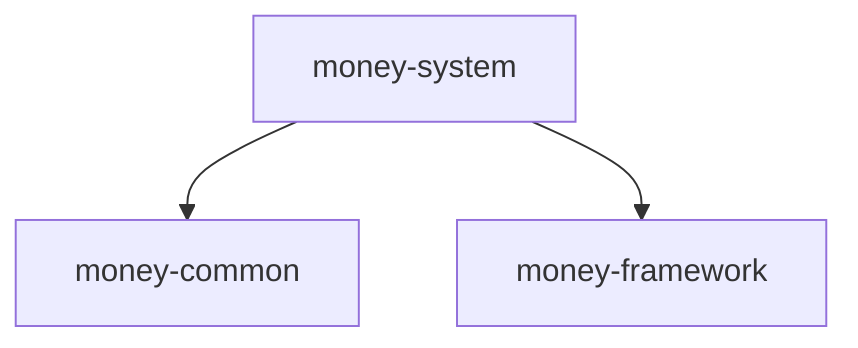
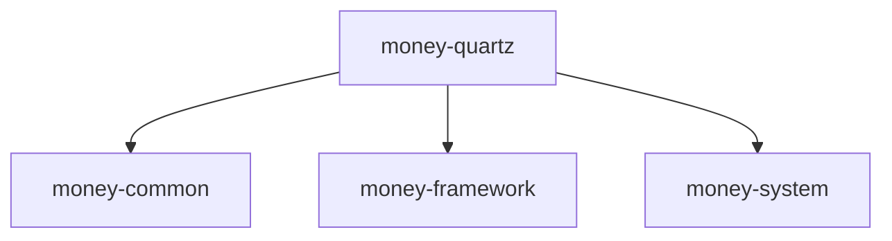
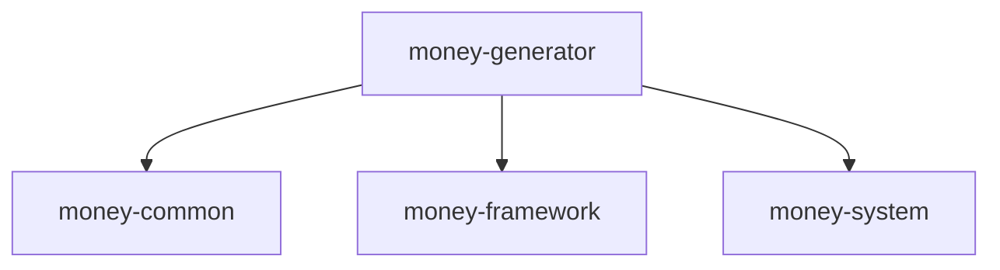
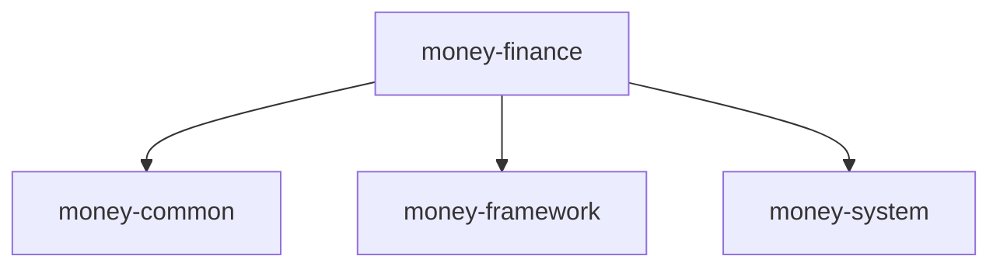
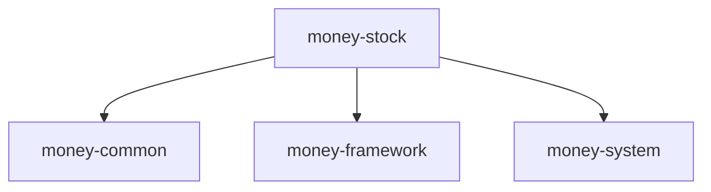
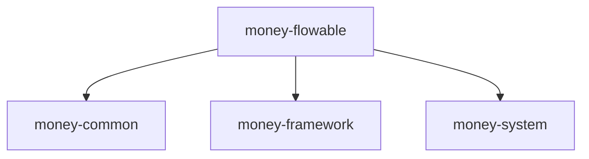
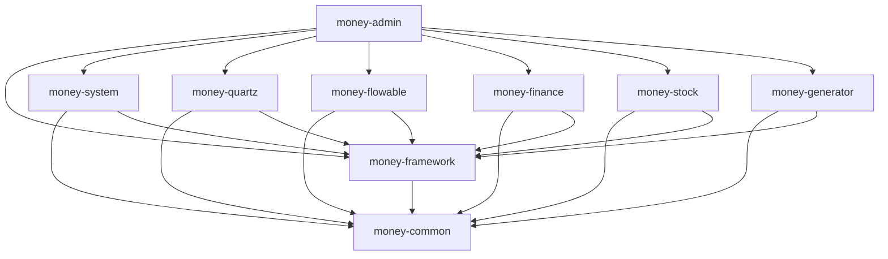

<p align="center">
  
</p>
<h1 align="center" style="margin: 30px 0 30px; font-weight: bold;">Make Money 管理系统</h1>
<h4 align="center">基于SpringBoot+Vue前后端分离的企业级管理系统</h4>

## 平台简介

Make Money 是一套基于SpringBoot和Vue技术栈开发的企业级管理系统，主要用于财务管理、股票交易、工作流集成等业务场景。

* 前端采用Vue3、Element Plus、Vite。
* 后端采用Spring Boot、Spring Security、Redis & Jwt。
* 权限认证使用Jwt，支持多终端认证系统。
* 支持加载动态权限菜单，多方式轻松权限控制。
* 高效率开发，使用代码生成器可以一键生成前后端代码。
* 集成工作流引擎 Flowable 6.8.0，支持复杂业务流程处理。
* 集成定时任务调度系统 Quartz，支持分布式任务调度。

## 内置功能

1.  用户管理：用户是系统操作者，该功能主要完成系统用户配置。
2.  部门管理：配置系统组织机构（公司、部门、小组），树结构展现支持数据权限。
3.  岗位管理：配置系统用户所属担任职务。
4.  菜单管理：配置系统菜单，操作权限，按钮权限标识等。
5.  角色管理：角色菜单权限分配、设置角色按机构进行数据范围权限划分。
6.  字典管理：对系统中经常使用的一些较为固定的数据进行维护。
7.  参数管理：对系统动态配置常用参数。
8.  通知公告：系统通知公告信息发布维护。
9.  操作日志：系统正常操作日志记录和查询；系统异常信息日志记录和查询。
10. 登录日志：系统登录日志记录查询包含登录异常。
11. 在线用户：当前系统中活跃用户状态监控。
12. 定时任务：在线（添加、修改、删除)任务调度包含执行结果日志。
13. 代码生成：前后端代码的生成（java、html、xml、sql）支持CRUD下载 。
14. 系统接口：根据业务代码自动生成相关的api接口文档。
15. 服务监控：监视当前系统CPU、内存、磁盘、堆栈等相关信息。
16. 缓存监控：对系统的缓存信息查询，命令统计等。
17. 在线构建器：拖动表单元素生成相应的HTML代码。
18. 连接池监视：监视当前系统数据库连接池状态，可进行分析SQL找出系统性能瓶颈。
19. 财务管理：财务管理相关功能模块。
20. 股票交易：股票交易相关功能模块。
21. 工作流引擎：集成Flowable工作流引擎，支持复杂业务流程处理。

## 项目模块说明

### 1. money-admin（系统核心管理模块）

系统启动入口模块，负责整合其他业务模块并启动SpringBoot应用。

**包结构说明**：
```
money-admin
├── src
│   └── main
│       ├── java
│       │   └── com.make.admin
│       │       ├── config     # 系统配置类
│       │       ├── controller # 系统管理控制器
│       │       └── MoneyAdminApplication.java # 启动类
│       └── resources
│           ├── application.yml      # 系统配置文件
│           ├── application-*.yml    # 环境配置文件
│           ├── static               # 静态资源
│           └── templates            # 模板文件
└── pom.xml                          # 模块依赖配置
```

**调用关系**：


### 2. money-common（公共工具类模块）

提供系统公共的工具类、常量定义、基础实体类等。

**包结构说明**：
```
money-common
├── src
│   └── main
│       └── java
│           └── com.make.common
│               ├── annotation   # 自定义注解
│               ├── config       # 公共配置
│               ├── constant     # 系统常量
│               ├── core         # 核心基础类
│               ├── enums        # 枚举类
│               ├── exception    # 自定义异常
│               ├── filter       # 过滤器
│               ├── utils        # 工具类
│               └── xss          # XSS防护
└── pom.xml                      # 模块依赖配置
```

**调用关系**：


### 3. money-framework（系统核心框架模块）

系统核心框架模块，包含安全认证、权限控制、日志管理、缓存管理等核心功能。

**包结构说明**：
```
money-framework
├── src
│   └── main
│       └── java
│           └── com.make.framework
│               ├── aspect       # 切面处理
│               ├── config       # 框架配置
│               ├── datasource   # 数据源管理
│               ├── interceptor  # 拦截器
│               ├── manager      # 通用业务处理
│               ├── security     # 安全认证
│               ├── web          # Web相关
│               └── ManagerApplication.java # 启动类
└── pom.xml                      # 模块依赖配置
```

**调用关系**：


### 4. money-system（系统基础功能模块）

系统基础功能模块，包含用户管理、部门管理、角色管理、菜单管理等基础功能。

**包结构说明**：
```
money-system
├── src
│   └── main
│       └── java
│           └── com.make.system
│               ├── domain       # 实体类
│               ├── mapper       # 数据访问层
│               ├── service      # 业务逻辑层
│               ├── controller   # 控制器层
│               └── SystemApplication.java # 启动类
└── pom.xml                      # 模块依赖配置
```

**调用关系**：


### 5. money-quartz（定时任务扩展模块）

定时任务扩展模块，基于Quartz实现分布式任务调度，支持任务分发、负载均衡等功能。

**包结构说明**：
```
money-quartz
├── src
│   └── main
│       └── java
│           └── com.make.quartz
│               ├── config       # Quartz配置
│               ├── controller   # 控制器
│               ├── domain       # 实体类
│               ├── mapper       # 数据访问层
│               ├── service      # 业务逻辑层
│               ├── task         # 具体任务实现
│               └── util         # 工具类
│                   ├── AbstractQuartzJob.java  # 抽象任务类
│                   ├── RedisMessageQueue.java  # Redis消息队列
│                   ├── SchedulerManager.java   # 调度管理器
│                   ├── TaskDistributor.java    # 任务分发器
│                   └── TaskExecutionService.java # 任务执行服务
└── pom.xml                      # 模块依赖配置
```

**调用关系**：


### 6. money-generator（代码生成器定制模块）

代码生成器模块，可根据数据库表结构一键生成前后端代码。

**包结构说明**：
```
money-generator
├── src
│   └── main
│       └── java
│           └── com.make.generator
│               ├── config       # 配置类
│               ├── controller   # 控制器
│               ├── domain       # 实体类
│               ├── mapper       # 数据访问层
│               ├── service      # 业务逻辑层
│               ├── util         # 工具类
│               └── GeneratorApplication.java # 启动类
└── pom.xml                      # 模块依赖配置
```

**调用关系**：


### 7. money-finance（财务管理系统模块）

财务管理系统模块，提供财务管理相关功能。

**包结构说明**：
```
money-finance
├── src
│   └── main
│       └── java
│           └── com.make.finance
│               ├── domain       # 实体类
│               ├── mapper       # 数据访问层
│               ├── service      # 业务逻辑层
│               ├── controller   # 控制器层
│               └── FinanceApplication.java # 启动类
└── pom.xml                      # 模块依赖配置
```

**调用关系**：


### 8. money-stock（股票交易管理模块）

股票交易管理模块，提供股票交易相关功能。

**包结构说明**：
```
money-stock
├── src
│   └── main
│       └── java
│           └── com.make.stock
│               ├── domain       # 实体类
│               ├── mapper       # 数据访问层
│               ├── service      # 业务逻辑层
│               ├── controller   # 控制器层
│               └── StockApplication.java # 启动类
└── pom.xml                      # 模块依赖配置
```

**调用关系**：


### 9. money-flowable（工作流引擎集成模块）

工作流引擎集成模块，集成Flowable工作流引擎，支持复杂业务流程处理。

**包结构说明**：
```
money-flowable
├── src
│   └── main
│       └── java
│           └── com.make.flowable
│               ├── config       # Flowable配置
│               ├── controller   # 控制器
│               ├── domain       # 实体类
│               ├── mapper       # 数据访问层
│               ├── service      # 业务逻辑层
│               └── FlowableApplication.java # 启动类
└── pom.xml                      # 模块依赖配置
```

**调用关系**：


## 技术选型

### 后端技术

| 技术 | 说明 | 版本 |
| ---- | ---- | ---- |
| Spring Boot | 容器+MVC框架 | 2.5.15 |
| Spring Security | 认证和授权框架 | 5.7.12 |
| MyBatis Plus | ORM框架 | 3.4.0 |
| Flowable | 工作流引擎 | 6.8.0 |
| Quartz | 作业调度框架 | - |
| Redis | 分布式缓存数据库 | - |
| FastJSON | JSON工具类 | 2.0.53 |
| Druid | 数据库连接池 | 1.2.23 |
| JWT | JWT登录支持 | 0.9.1 |
| Oshi | 服务器监控 | 6.8.1 |
| Swagger | 接口文档框架 | 3.0.0 |

### 前端技术

| 技术 | 说明 | 版本 |
| ---- | ---- | ---- |
| Vue | 前端框架 | 3.x |
| Element Plus | UI组件库 | - |
| Vite | 构建工具 | - |
| ECharts | 图表库 | 5.6.0 |
| Vue-ECharts | Vue图表组件 | 7.0.3 |

## 架构设计

### 系统架构图

```
┌─────────────────────┐
│      Browser        │
└─────────────────────┘
          │
┌─────────────────────┐
│   Nginx/WebServer   │
└─────────────────────┘
          │
┌─────────────────────┐    ┌─────────────────────┐
│   Vue3 Frontend     │◄──►│  SpringBoot Backend │
└─────────────────────┘    └─────────────────────┘
                                    │
                   ┌────────────────┼────────────────┐
                   │                │                │
            ┌────────────┐   ┌────────────┐   ┌────────────┐
            │   MySQL    │   │   Redis    │   │  Flowable  │
            └────────────┘   └────────────┘   └────────────┘
```

### 模块调用关系图



### 核心模块说明

1. **money-quartz 分布式调度**：
   - 基于Redis的分布式锁(`RedisQuartzSemaphore`)
   - 任务类型：
     - `QuartzDisallowConcurrentExecution`（禁止并发执行）
     - `GoldViewTask`（黄金数据抓取任务）
   - 调度策略：
     ```java
     // 示例：创建每5分钟执行的金融数据同步任务
     Trigger trigger = TriggerBuilder.newTrigger()
         .withIdentity("financeSync", "group1")
         .withSchedule(CronScheduleBuilder.cronSchedule("0 0/5 * * * ?"))
         .build();
     ```

2. **money-finance 金融管理**：
   - 核心功能：
     - 资产记录管理(`AssetRecordMapper`)
     - 贷款还款跟踪(`LoanRepaymentsMapper`)
     - 年度存款汇总(`AnnualDepositSummaryMapper`)

3. **money-stock 股票监控**：
   - 数据流架构：
     ```mermaid
     sequenceDiagram
         股票API->>ETL服务: 原始数据
         ETL服务->>数据库: 清洗存储
         Quartz任务->>告警服务: 触发价格监控
         告警服务->>前端: 实时推送
     ```

### 模块调用关系图


## 环境要求

### 开发环境

- JDK 1.8 或以上
- Maven 3.x
- MySQL 5.7 或以上
- Redis
- Node.js 14+

### 运行环境

- JRE 1.8 或以上
- MySQL 5.7 或以上
- Redis
- Nginx（可选，用于部署前端）

## 部署说明

### 后端部署

1. 创建数据库并导入sql目录下的数据库脚本
2. 修改application.yml配置文件中的数据库和Redis连接信息
3. 执行mvn clean package命令打包
4. 运行java -jar money-admin.jar启动服务

### 前端部署

1. 进入money-ui目录
2. 执行npm install安装依赖
3. 执行npm run build构建生产环境
4. 将dist目录下的文件部署到Nginx等Web服务器

## 特色功能

### 分布式任务调度

基于Redis实现的分布式任务调度系统，支持：
- 主节点选举机制
- 负载均衡策略
- 任务分发机制
- 节点状态监控

### Redis消息队列

基于Redis实现的简易消息队列系统，用于：
- 分布式节点间任务消息传递
- 消息持久化保证
- 异步任务处理

### 工作流引擎集成

集成Flowable工作流引擎，支持：
- 流程定义管理
- 流程实例管理
- 任务分配与处理
- 流程监控与统计

## API接口规范

### 1. 基础规范
- **协议**：HTTP/HTTPS
- **数据格式**：JSON
- **认证方式**：JWT Token（Authorization头）
- **响应结构**：
  ```json
  {
    "code": 200,
    "msg": "success",
    "data": {}
  }
  ```

### 2. 接口分类
| 分类 | 前缀 | 示例 | 说明 |
|------|------|------|------|
| 系统管理 | /system | /system/user | 用户、角色等管理 |
| 监控 | /monitor | /monitor/cache | 系统监控接口 |
| 金融 | /finance | /finance/asset_record | 财务相关接口 |
| 股票 | /stock | /stock/etf_data | 股票交易接口 |
| 工作流 | /flowable | /flowable/task | 流程引擎接口 |

### 3. 通用状态码
| 状态码 | 说明 |
|--------|------|
| 200 | 请求成功 |
| 401 | 未授权 |
| 403 | 禁止访问 |
| 404 | 资源不存在 |
| 500 | 服务器错误 |

### 4. 示例接口
**获取用户列表**：
```http
GET /system/user/list
Headers:
  Authorization: Bearer {token}
Params:
  pageNum=1
  pageSize=10
Response:
{
  "code": 200,
  "msg": "success",
  "data": {
    "total": 100,
    "rows": [{
      "userId": 1,
      "userName": "admin"
    }]
  }
}
```

**创建定时任务**：
```http
POST /monitor/job
Headers:
  Authorization: Bearer {token}
  Content-Type: application/json
Body:
{
  "jobName": "数据同步",
  "jobGroup": "DEFAULT",
  "cronExpression": "0 0/5 * * * ?"
}
Response:
{
  "code": 200,
  "msg": "任务创建成功"
}
```

## 开发指南

### 代码生成

系统提供代码生成器，可根据数据库表一键生成前后端代码：
1. 在系统菜单中进入"代码生成"页面
2. 选择需要生成代码的数据表
3. 点击"生成代码"按钮
4. 下载生成的代码并导入到项目中

### 权限控制

系统支持基于角色的权限控制(RBAC)：
1. 菜单权限：控制用户可访问的菜单项
2. 按钮权限：控制用户可操作的按钮功能
3. 数据权限：控制用户可访问的数据范围


## Python 服务说明

### 一、服务定位与职责

本项目中的 **Stock Data Service**（位于 `python/` 目录）是一个专门的微服务，主要承担以下职责：

*   **金融数据采集**：利用 Playwright (Chromium) 获取实时股票/ETF行情及K线数据，绕过反爬虫机制。
*   **标准 API 接口**：为 Java 后端（`money-stock` 模块）提供 RESTful API 数据服务。
*   **高可用性保障**：管理浏览器上下文生命周期与并发控制，确保数据流稳定。

### 二、技术栈

*   **语言**：Python >= 3.9
*   **Web 框架**：FastAPI
*   **服务器**：Uvicorn (ASGI) / Gunicorn (进程管理)
*   **核心引擎**：Playwright (Headless Chromium)
*   **数据格式**：JSON

### 三、目录结构说明（Python 服务）

```text
MyHome/
├── python/
│   ├── stock_service.py     # 服务主入口 (FastAPI)
│   ├── gunicorn_conf.py     # Gunicorn 配置文件
│   ├── requirements.txt     # Python 依赖
│   └── logs/                # 服务日志
```

### 四、环境准备

1.  **创建虚拟环境（推荐）**
    ```bash
    cd python
    python3 -m venv venv
    source venv/bin/activate      # macOS / Linux
    # venv\Scripts\activate       # Windows
    ```

2.  **安装依赖**
    ```bash
    pip install -r requirements.txt
    playwright install chromium
    ```

### 五、服务启动方式

**1. 本地开发模式**
```bash
# 在 'python' 目录下运行
uvicorn stock_service:app --host 0.0.0.0 --port 8000 --reload
```
*   服务监听：`http://localhost:8000`
*   Swagger 文档：`http://localhost:8000/docs`

**2. 生产环境模式 (Gunicorn)**
```bash
# 使用提供的脚本
./start_service.sh
```

### 六、配置说明

主要配置位于 `stock_service.py` 和 `gunicorn_conf.py`：
*   **端口**：默认 8000。
*   **日志**：存储在 `python/logs/`（每日轮转）。
*   **并发**：通过 `stock_service.py` 中的 `asyncio.Semaphore(10)` 和 Gunicorn worker 控制。

### 七、接口调用示例

**示例 1：健康检查**
*   **URL**: `/health`
*   **Method**: `GET`
*   **Response**:
    ```json
    {
      "status": "ok",
      "browser": true
    }
    ```

**示例 2：获取股票 K 线**
*   **URL**: `/stock/kline`
*   **Method**: `POST`
*   **Body**:
    ```json
    {
      "secid": "0.600000",
      "ndays": 5
    }
    ```
*   **Response**:
    ```json
    [
      {
        "trade_date": "2023-10-27",
        "open": 7.35,
        "close": 7.40,
        ...
      }
    ]
    ```

**示例 3：获取实时行情**
*   **URL**: `/stock/realtime`
*   **Method**: `POST`
*   **Body**:
    ```json
    {
      "url": "https://push2.eastmoney.com/api/qt/stock/get?..."
    }
    ```

### 八、需求描述（完善版）

**功能性需求**
*   对外提供稳定的 Stock/ETF 数据 HTTP API。
*   支持自动化的浏览器生命周期管理 (Playwright)。
*   将上游数据标准化为严格的 JSON 格式供 Java DTO 使用。
*   实现防御性校验（如处理空数据、对异常输入返回 422）。

**非功能性需求**
*   **延迟**：API 响应时间 ≤ 2s（取决于上游网络）。
*   **稳定性**：自动回收浏览器上下文以防止内存泄漏。
*   **可观测性**：提供结构化日志（`[FETCH_START]`, `[FETCH_SUCCESS]`）以便追踪。

### 九、常见问题

**端口 8000 被占用**
修改 `gunicorn_conf.py` 或启动参数。

**缺少 Playwright 浏览器**
在环境中运行 `playwright install chromium`。
