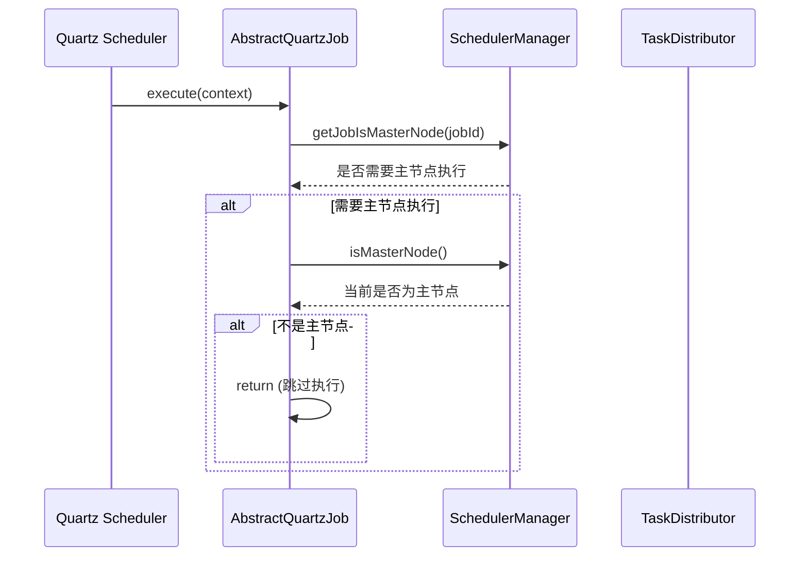
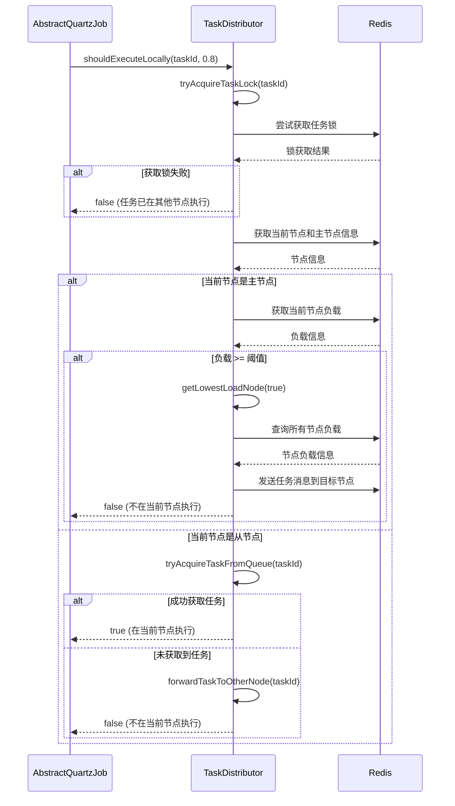
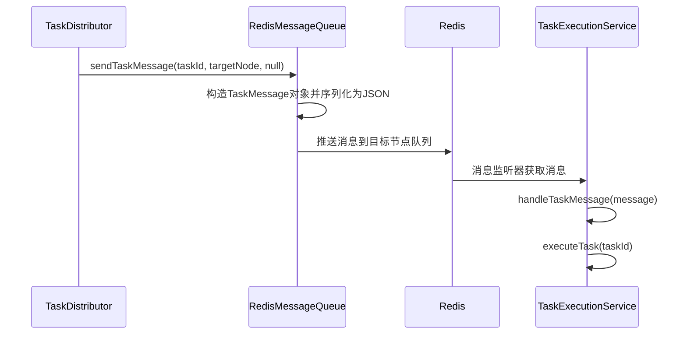

# 分布式任务调度完整流程说明

## 1. 整体架构

系统采用基于Redis的分布式任务调度机制，通过主从节点协调工作，实现任务的负载均衡和高可用性。

## 2. 核心组件

### 2.1 AbstractQuartzJob
任务执行的入口类，负责任务的调度和执行决策。

### 2.2 TaskDistributor
任务分发器，负责决定任务在哪个节点执行。

### 2.3 RedisMessageQueue
Redis消息队列，用于节点间任务消息传递。

### 2.4 TaskExecutionService
任务执行服务，处理从消息队列接收到的任务。

### 2.5 SchedulerManager
调度管理器，负责节点管理和状态上报。

## 3. 任务执行完整流程

### 3.1 任务触发


### 3.2 任务分发决策


### 3.3 消息发送与处理


## 4. 详细实现说明

### 4.1 任务触发阶段

1. Quartz调度器根据配置触发任务执行
2. 调用[AbstractQuartzJob.execute()](file:///D:/gitee/make-money/money-quartz/src/main/java/com/make/quartz/util/AbstractQuartzJob.java#L45-L127)方法
3. 检查任务是否需要主节点执行
4. 获取分布式锁防止重复执行

### 4.2 任务分发决策阶段

1. [AbstractQuartzJob](file:///D:/gitee/make-money/money-quartz/src/main/java/com/make/quartz/util/AbstractQuartzJob.java#L26-L166)调用[TaskDistributor.shouldExecuteLocally()](file:///D:/gitee/make-money/money-quartz/src/main/java/com/make/quartz/util/TaskDistributor.java#L143-L187)决定任务是否在当前节点执行
2. 如果当前是主节点且负载超过阈值(默认80%)，会选择一个负载较低的节点执行任务
3. 从节点会主动尝试从任务队列中获取任务，分担主节点压力

### 4.3 消息发送阶段

1. 通过[RedisMessageQueue.sendTaskMessage()](file:///D:/gitee/make-money/money-quartz/src/main/java/com/make/quartz/util/RedisMessageQueue.java#L89-L114)发送任务消息给目标节点
2. 消息包含任务ID、目标节点和任务数据
3. 消息被序列化为JSON格式并推送到目标节点的Redis队列中

### 4.4 消息处理阶段

1. 每个节点通过[RedisMessageQueue.startListening()](file:///D:/gitee/make-money/money-quartz/src/main/java/com/make/quartz/util/RedisMessageQueue.java#L121-L153)监听自己的队列
2. 接收到消息后，由[TaskExecutionService](file:///D:/gitee/make-money/money-quartz/src/main/java/com/make/quartz/service/TaskExecutionService.java#L16-L137)处理任务执行
3. [TaskExecutionService.handleTaskMessage()](file:///D:/gitee/make-money/money-quartz/src/main/java/com/make/quartz/service/TaskExecutionService.java#L63-L78)方法解析消息并调用实际的任务执行逻辑

### 4.5 Quartz任务执行阶段

1. [TaskExecutionService.executeTask()](file:///D:/gitee/make-money/money-quartz/src/main/java/com/make/quartz/service/TaskExecutionService.java#L83-L122)方法解析任务ID获取组名和任务名
2. 通过Scheduler获取JobDetail获取任务详情
3. 从JobDataMap中获取任务配置信息
4. 调用[JobInvokeUtil.invokeMethod()](file:///D:/gitee/make-money/money-quartz/src/main/java/com/make/quartz/util/JobInvokeUtil.java#L22-L33)执行具体的任务方法

## 5. 关键特性

### 5.1 负载均衡
- 主节点根据负载情况动态分发任务
- 从节点可以主动获取任务，分担主节点压力
- 系统选择负载最低的节点执行任务

### 5.2 防止重复执行
- 使用Redis分布式锁确保任务不会在多个节点同时执行
- 任务锁机制防止重复调度

### 5.3 高可用性
- 节点自动注册和发现
- 心跳检测机制
- 失效节点自动清理

### 5.4 容错处理
- 消息处理异常不会影响整个系统
- 错误消息会被跳过，不影响后续消息处理
- 任务执行异常有完整的日志记录

## 6. 配置说明

### 6.1 负载阈值
主节点负载阈值默认为0.8(80%)，超过此阈值时会触发任务分发。

### 6.2 节点心跳
节点心跳超时时间为30秒，超过此时间未更新心跳的节点会被认为已失效。

### 6.3 消息队列
使用Redis的List数据结构实现消息队列，每个节点监听自己的队列。

## 7. Quartz任务执行详细流程

### 7.1 任务执行入口
Quartz任务执行的入口是[AbstractQuartzJob.execute()](file:///D:/gitee/make-money/money-quartz/src/main/java/com/make/quartz/util/AbstractQuartzJob.java#L45-L127)方法，它定义了任务执行的整体流程。

### 7.2 任务执行类型
系统支持两种任务执行类型：
1. [QuartzJobExecution](file:///D:/gitee/make-money/money-quartz/src/main/java/com/make/quartz/util/QuartzJobExecution.java#L7-L16) - 允许并发执行的任务
2. [QuartzDisallowConcurrentExecution](file:///D:/gitee/make-money/money-quartz/src/main/java/com/make/quartz/util/QuartzDisallowConcurrentExecution.java#L16-L33) - 禁止并发执行的任务

### 7.3 任务方法调用
任务方法调用通过[JobInvokeUtil](file:///D:/gitee/make-money/money-quartz/src/main/java/com/make/quartz/util/JobInvokeUtil.java#L16-L159)工具类完成，流程如下：

1. 解析任务目标字符串，获取Bean名称、方法名称和方法参数
2. 根据Bean名称从Spring容器中获取Bean实例或者通过反射创建实例
3. 获取要调用的方法对象
4. 调用方法并传递参数

### 7.4 任务目标字符串格式
任务目标字符串的格式为：`bean名称.方法名称(参数1, 参数2, ...)`
例如：`demoTask.demoMethod("参数1", 123, true)`

### 7.5 参数类型支持
系统支持以下参数类型：
- String类型：以'或"开头的字符串
- boolean类型：true或false
- long类型：以L结尾的数字
- double类型：以D结尾的数字
- 其他类型：默认按整数处理

### 7.6 分布式任务执行
当任务被分发到其他节点执行时，流程如下：
1. 主节点通过[TaskDistributor](file:///D:/gitee/make-money/money-quartz/src/main/java/com/make/quartz/util/TaskDistributor.java#L22-L271)判断是否需要分发任务
2. 如果需要分发，通过[RedisMessageQueue](file:///D:/gitee/make-money/money-quartz/src/main/java/com/make/quartz/util/RedisMessageQueue.java#L21-L256)发送任务消息到目标节点
3. 目标节点通过[TaskExecutionService](file:///D:/gitee/make-money/money-quartz/src/main/java/com/make/quartz/service/TaskExecutionService.java#L16-L137)接收消息并执行任务
4. [TaskExecutionService.executeTask()](file:///D:/gitee/make-money/money-quartz/src/main/java/com/make/quartz/service/TaskExecutionService.java#L83-L122)方法通过Quartz的Scheduler重新获取任务详情并执行

## 8. 消息格式兼容性处理

### 8.1 消息格式演进
系统中的消息传递机制经历了两个阶段：
1. 初期直接使用RedisTemplate发送原始任务ID字符串
2. 后期改为使用RedisMessageQueue发送JSON格式的TaskMessage对象

### 8.2 兼容性处理
为了确保系统平滑升级，[RedisMessageQueue](file:///D:/gitee/make-money/money-quartz/src/main/java/com/make/quartz/util/RedisMessageQueue.java#L21-L256)实现了对两种消息格式的兼容处理：

1. 首先尝试按JSON格式解析消息
2. 如果JSON解析失败，则尝试按旧格式（直接的任务ID字符串）解析
3. 两种格式都解析失败时，记录错误日志并跳过该消息

### 8.3 统一消息发送
为避免混淆，已将所有消息发送操作统一改为使用RedisMessageQueue：
1. [TaskDistributor](file:///D:/gitee/make-money/money-quartz/src/main/java/com/make/quartz/util/TaskDistributor.java#L22-L271)中发送任务消息
2. [SchedulerManager](file:///D:/gitee/make-money/money-quartz/src/main/java/com/make/quartz/util/SchedulerManager.java#L38-L643)中发送任务消息

这种统一处理确保了所有节点间通信都使用一致的JSON格式，提高了系统的稳定性和可维护性。

## 9. 任务一致性维护

### 9.1 问题背景
在分布式环境下，Quartz调度器与数据库中的任务记录可能出现不一致的情况，导致如下错误：
```
org.quartz.JobPersistenceException: Couldn't acquire next trigger: 
Couldn't retrieve trigger: No record found for selection of Trigger with key: 'DEFAULT.TASK_CLASS_NAME4'
```

### 9.2 解决方案
系统引入了[QuartzJobCleaner](file:///D:/gitee/make-money/money-quartz/src/main/java/com/make/quartz/util/QuartzJobCleaner.java#L15-L127)工具类来维护任务一致性：

1. 应用启动时自动执行一致性检查
2. 检查调度器中存在但数据库中不存在的任务，并删除这些不一致任务
3. 检查数据库中存在但调度器中不存在的任务，并重新创建这些缺失任务

### 9.3 实现机制
[QuartzJobCleaner](file:///D:/gitee/make-money/money-quartz/src/main/java/com/make/quartz/util/QuartzJobCleaner.java#L15-L127)通过以下步骤维护任务一致性：

1. 获取数据库中的所有任务记录
2. 获取调度器中的所有任务信息
3. 对比两边的任务信息，找出不一致的记录
4. 删除调度器中的不一致任务
5. 重新创建数据库中缺失的任务

### 9.4 容错处理
在一致性检查和修复过程中：

1. 单个任务处理失败不会影响其他任务的处理
2. 所有操作都有详细的日志记录，便于问题追踪
3. 异常情况会被捕获并记录，不会导致整个清理过程失败
4. 提供了手动触发清理的接口，便于运维操作