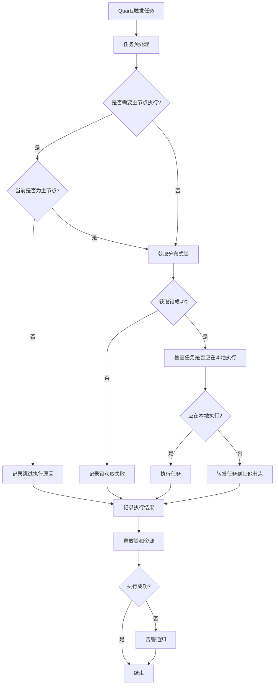
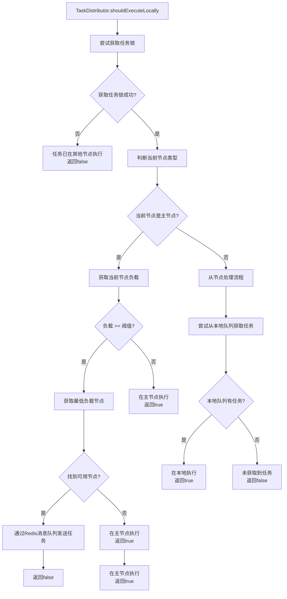
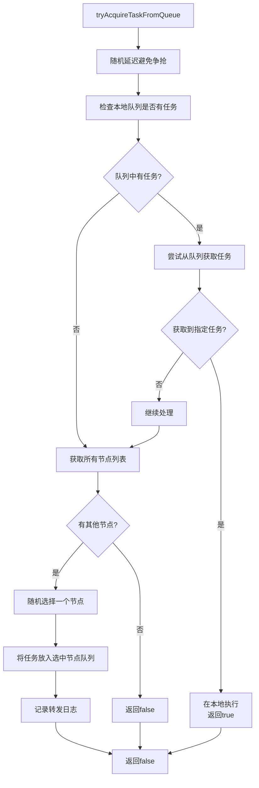
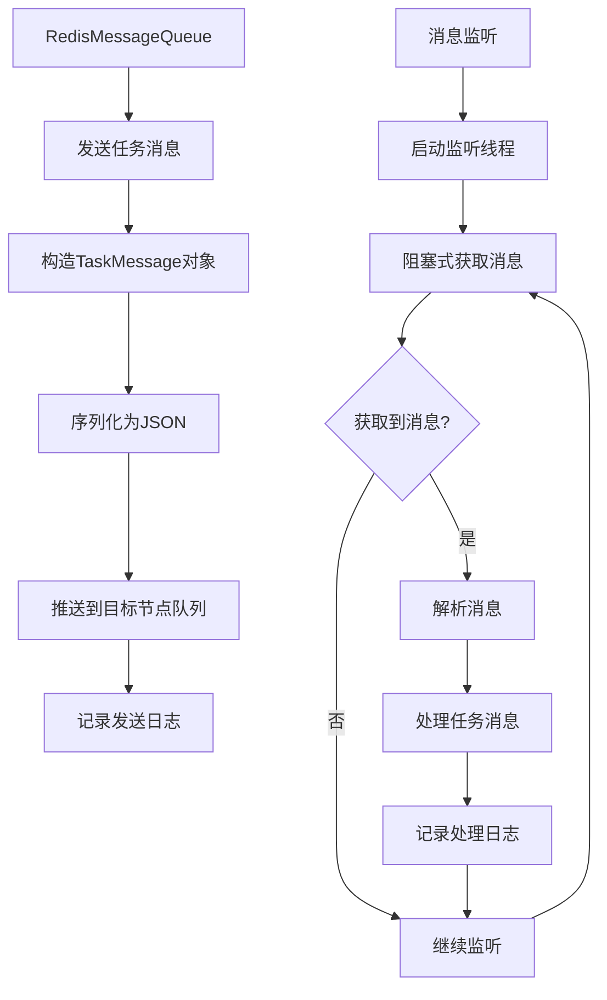

# 任务执行流程图

## 1. 整体流程

## 2. 任务分发决策流程

## 3. 从节点任务获取流程

## 4. Redis消息队列处理流程

## 5. 详细说明

### 5.1 主节点任务处理流程

1. **任务触发**: Quartz根据调度配置触发任务执行
2. **主节点检查**: 
   - 检查任务是否需要在主节点执行
   - 如果需要但当前不是主节点，则跳过执行
3. **获取分布式锁**: 
   - 使用Redis分布式锁确保任务不会在多个节点同时执行
   - 锁的key为`quartz:lock:` + jobKey
4. **任务分发决策**: 
   - 检查主节点当前负载情况
   - 如果负载超过阈值(默认80%)，选择负载最低的节点执行任务
   - 通过Redis消息队列发送任务给目标节点
5. **任务执行**: 
   - 如果任务应在当前节点执行，则调用具体业务逻辑
   - 通过JobInvokeUtil.invokeMethod()调用配置的业务方法
6. **资源清理**: 
   - 释放分布式锁
   - 清理任务锁
   - 记录任务执行日志

### 5.2 从节点任务处理流程

1. **任务监听**: 
   - 从节点监听自己的Redis任务队列
   - 定期检查队列中是否有待处理任务
2. **任务获取**: 
   - 从队列中获取任务消息
   - 解析任务信息
3. **任务执行**: 
   - 执行具体的业务逻辑
   - 记录执行日志
4. **主动获取**: 
   - 从节点也可以主动尝试获取任务
   - 如果本地队列没有任务，可以转发给其他节点

### 5.3 负载均衡机制

1. **负载检测**: 
   - 定期上报各节点线程池使用率
   - 使用率 = 活跃线程数 / 最大线程数
2. **负载判断**: 
   - 主节点负载阈值默认为0.8(80%)
   - 超过阈值时触发任务分发
3. **节点选择**: 
   - 选择线程池使用率最低的节点执行任务
   - 确保整个集群的负载均衡

### 5.4 防止重复执行机制

1. **Quartz分布式锁**: 
   - 确保同一任务在集群环境中不会被多个节点同时调度
2. **任务执行锁**: 
   - 确保同一任务不会在多个节点同时执行
3. **@DisallowConcurrentExecution注解**: 
   - 确保特定任务不会并发执行
4. **消息队列隔离**: 
   - 每个节点只处理自己的队列中的任务
